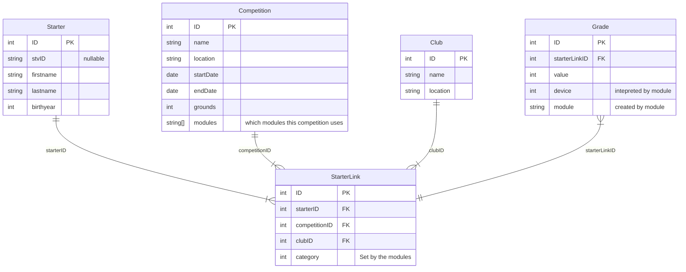
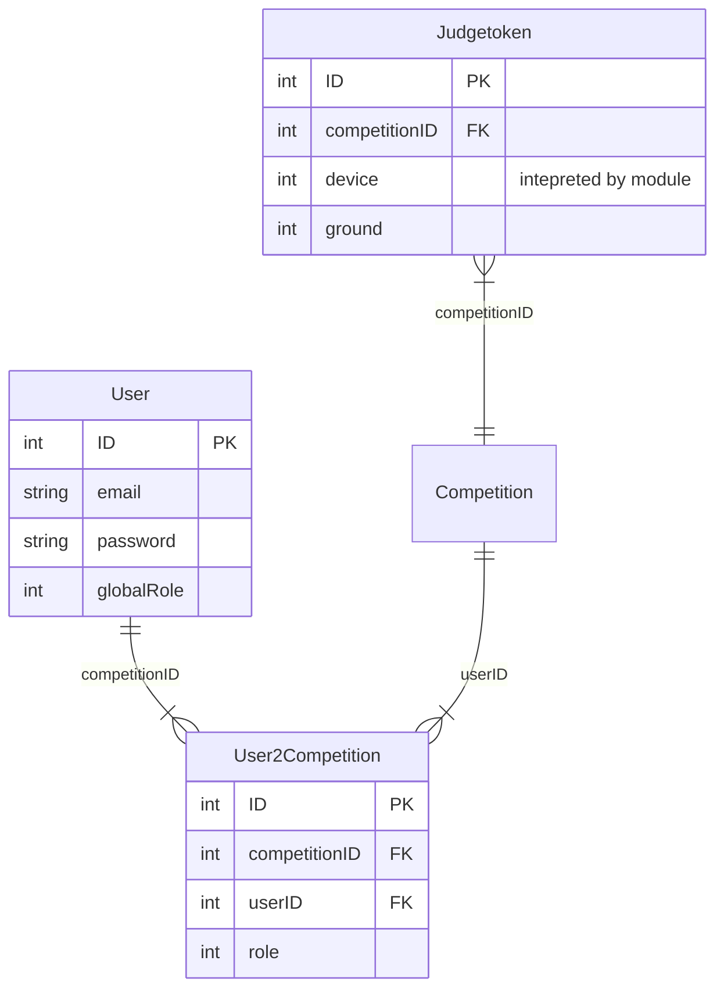
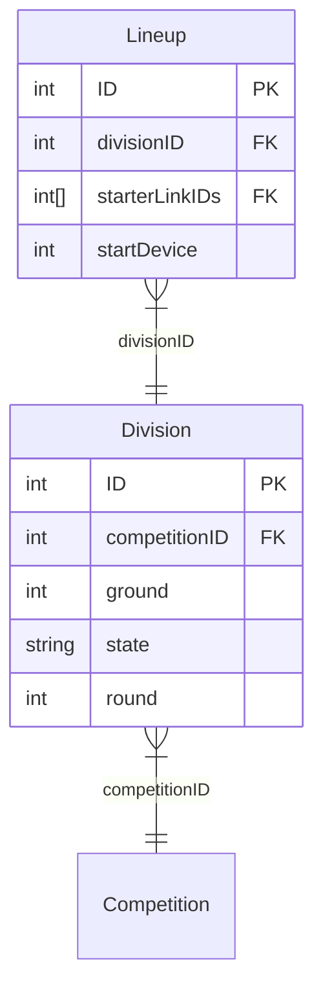

## Base schema without module

```mermaid
erDiagram
    Starter {
        int ID PK
        string stvID "nullable"
        string firstname
        string lastname
        int birthyear
    }

    Club {
        int ID PK
        string name
        string location
    }

    Competition {
        int ID PK
        string name
        string location
        date startDate
        date endDate
        int grounds
        string[] modules "which modules this competition uses"
    }

    StarterLink {
        int ID PK
        int starterID FK
        int competitionID FK
        int clubID FK
        int category "Set by the modules"
    }

    Starter ||--}| StarterLink : starterID
    Competition ||--}| StarterLink : competitionID
    Club ||--}| StarterLink : clubID

    Grade {
        int ID PK
        int starterLinkID FK
        int value
        int device "intepreted by module"
        string module "created by module"
    }

    Grade |{--|| StarterLink: starterLinkID
```

## Auth Module schema

```mermaid
erDiagram
    User {
        int ID PK
        string email 
        string password
        int globalRole
    }

    User2Competition {
        int ID PK
        int competitionID FK
        int userID FK
        int role
    }

    User ||--}| User2Competition: competitionID
    Competition ||--}| User2Competition: userID

    Judgetoken {
        int ID PK
        int competitionID FK
        int device "intepreted by module"
        int ground
    }
    
    Judgetoken |{--|| Competition: competitionID
```

## EGT Module schema

Entities created by the EGT module are prefixed with `EGT_`

```mermaid
erDiagram
    EGT_Division["Division"] {
        int ID PK
        int competitionID FK
        int ground
        string state
        int round
    }

    EGT_Division |{--|| Competition: competitionID

    EGT_Lineup["Lineup"] {
        int ID PK
        int divisionID FK
        int[] starterLinkIDs FK
        int startDevice
    }

    EGT_Lineup |{--|| EGT_Division: divisionID
```
