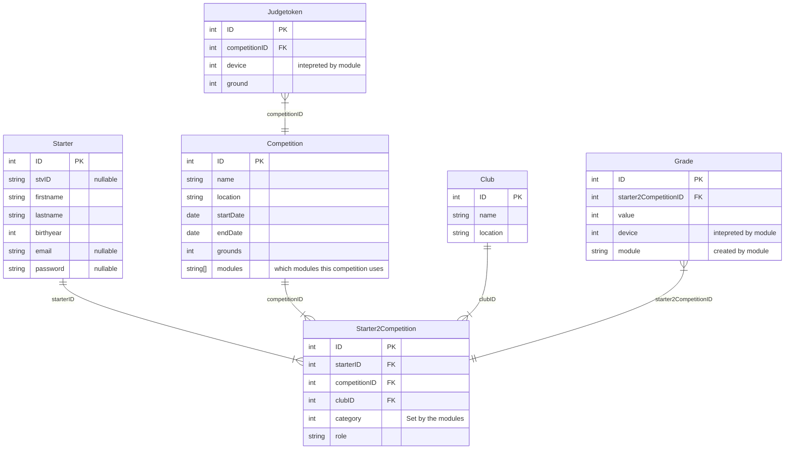
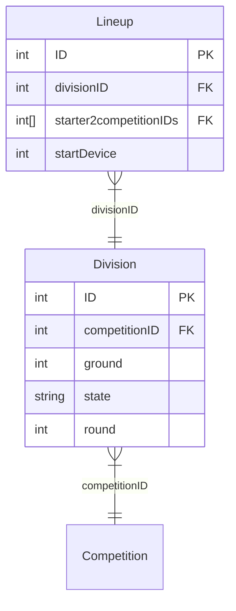

## Base schema without module

```mermaid
erDiagram
    Starter {
        int ID PK
        string stvID "nullable"
        string firstname
        string lastname
        int birthyear
        string email "nullable"
        string password "nullable"
    }

    Club {
        int ID PK
        string name
        string location
    }

    Competition {
        int ID PK
        string name
        string location
        date startDate
        date endDate
        int grounds
        string[] modules "which modules this competition uses"
    }

    Starter2Competition {
        int ID PK
        int starterID FK
        int competitionID FK
        int clubID FK
        int category "Set by the modules"
        string role
    }

    Starter ||--}| Starter2Competition : starterID
    Competition ||--}| Starter2Competition : competitionID
    Club ||--}| Starter2Competition : clubID

    Grade {
        int ID PK
        int starter2CompetitionID FK
        int value
        int device "intepreted by module"
        string module "created by module"
    }

    Grade |{--|| Starter2Competition: starter2CompetitionID

    Judgetoken {
        int ID PK
        int competitionID FK
        int device "intepreted by module"
        int ground
    }
    
    Judgetoken |{--|| Competition: competitionID
```

## EGT Module schema

Entities created by the EGT module are prefixed with `EGT_`

```mermaid
erDiagram
    EGT_Division["Division"] {
        int ID PK
        int competitionID FK
        int ground
        string state
        int round
    }

    EGT_Division |{--|| Competition: competitionID

    EGT_Lineup["Lineup"] {
        int ID PK
        int divisionID FK
        int[] starter2competitionIDs FK
        int startDevice
    }

    EGT_Lineup |{--|| EGT_Division: divisionID
```
